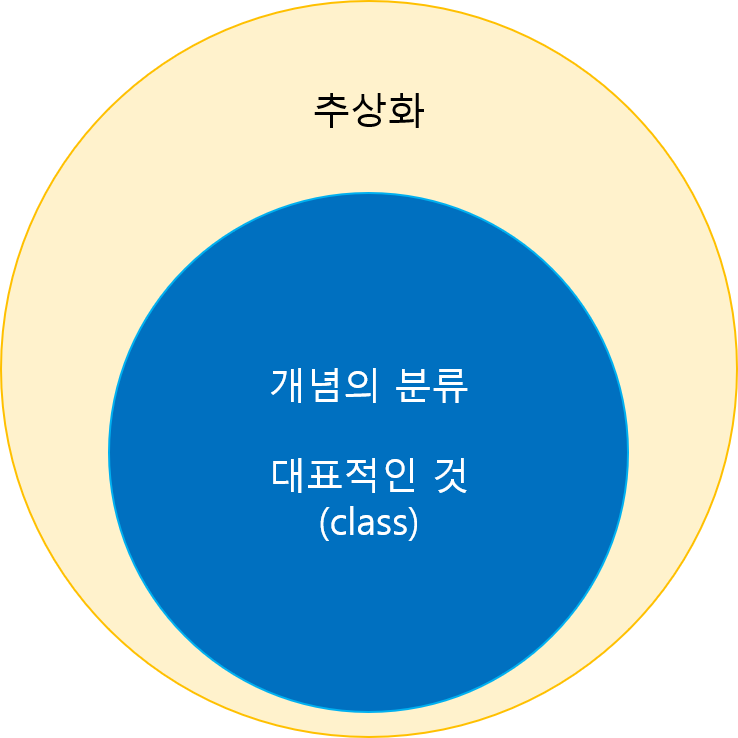

# 책의 리뷰📔
> part : 3장    
> chapter : 타입과 추상화
> CreateDate : 2022. 05. 31 
> UpdateDate :  

  

# 타입과 추상화
- 프로그램을 작성하기 위해 중요한 전제 조건은 추상화를 정확하게 다루는 능력이라는 것!

##  추상화의 가장 대표적인 예시 지하철 노선도
 - 처음 지하철 노선도는 지도라는 역할을 하기 위해 사실 그대로, 구불구불한 운행 노선과 불 규칙적인 역간의 거리를 묘사했다.
 - 하지만, 실제로 지하철을 이용하는 승객의 목적은 하나의 역에서 다른 역으로 이동하는 것이지, 실제 운행노선과, 역간의 거리는 필요가 없다.
 - 그래서 나온것인 해리 벡이 창조한 지하철 노선도 이다. 
### 즉, 추상화란?
 - 어떤 양상이나, 세부사항, 구조를 더 명확하게 이해라기위해 특정 절차나 물체를의도적으로 생략하거나 감춤으로써 복잡도를 극복하는 방법이다. 
 - 복잡성을 다루기 위해서 2가지 방법이 있다. 
    - 1. 구체적인 사물들 간의 공통점을 취하고, 차이점을 버리는 **일반화**
    - 2. 중요한 부분을 강조하기위해 불필요한 세부사항을 제거함으로써의 **단순화** 

### 애플의 경영철학
 - **적은 것이 더 낫다 , 심플함이 복잡함을 이긴다.** 
 - 추상화는 개발영역 뿐만 아니라,  현실에서도 매우 중요한 영역

  

## 이상한 나라의 엘리스 예시 
 - 정원사 트럼프, 병사 트럼프, 왕자/공주, 하객 그리고 하트왕과 하트여왕 트럼프가 나오지만, 
 - 각자 개성과 독특한 특징을 가지지만, **공통점**인 트럼프를 언급한다.
### 개념 
 - 사람은 본능적으로 공통적인 특성을 기준으로 객체를 여러그룹으로 묶어 동시에 다뤄야하는 가짓수를 줄임으로써 상황을 단순화하려한다. 
      - 여기서 객체들을 묶기 위한 그릇을 **개념**이라고 한다.
      - 개념의 예시로는 자동차, 비행기, 책상, 모니터등
#### 인스턴스
 - 위와 같이 개념을 이용하여 객체들을 담고, 여러 그룹으로 **분류**할 수 있다.
 - 그럼 하트여왕과 같이 "트럼프"라는 개념의 그룹의 일원이 되었을 때, 그것을 개념의 인스턴스라고 한다.

#### 개념의 세가지 관점
 - 심볼 : 개념을 가리키는 간략한 이름이나 명칭  (ex)트럼프
 - 내연 : 개념의 완전한 정의를 나타내며, 내연의 의미를 이용해 객체가 개념에 속하는지 여부 확인
    -(ex)납작하고 두 손과 발이 네모난 몸 모서리에 달려있다는 트럼프에 대한 설명 
 - 외연 : 개념에 속하는 모든 객체의 집합
    -(ex) 하트여왕 말고도, 정원사, 병사, 신하, 하객, 공주와 왕자 등 
    
> 위의 3가지 관점을 잘 활용한 유명인사가 클래스(class)이다. 
> 이러니, 객체와 클래스가 혼돈될 수 밖에..

#### 분류는 추상화를 위한 도구 
 - 결국 개념을 통해 객체를 분류하는 작업은 추상화의 2가지 차원을 모두 사용한다. 
 
 
    
  
## 타입
타입은 개념이다. 

### 객체와 타입

  

## 느낀점 😌
  

## 그밖의 내용🎈
