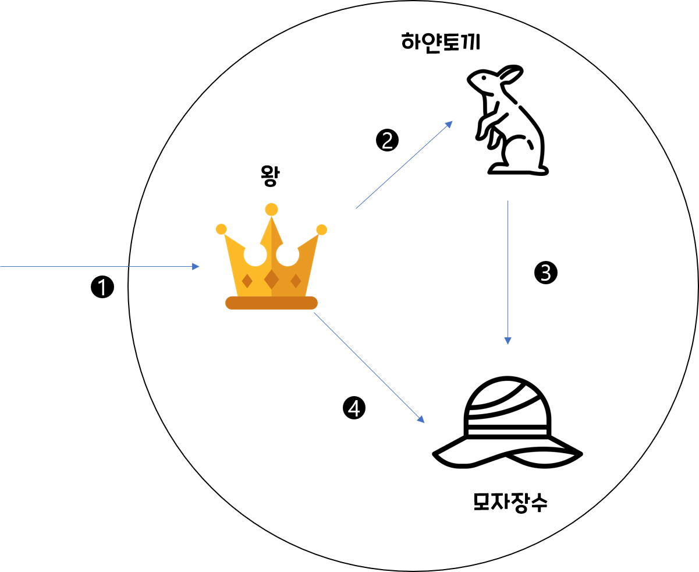

# 책의 리뷰📔
> part : 4장  
> chapter : 역할, 책임, 협력  
> CreateDate : 2022.06.01  
> UpdateDate :    
 
## 역할, 책임, 협력  
 - 객체의 세계에서는 객체가 가져야할 상태와 행동뿐만 아니라 협력도 매우 중요한 고려사항이다.
 - 결국, 객체지향 설계의 품질은 역할, 책임, 협력에 의해 결정된다.

### 협력의 예시
 - 요청하고 응답하며 협력
 - 이상한 나라의 엘리스 재판 모습
  
 
 
 - 왕, 하얀토끼, 모자 장수가 등장하고, 서로 재판이라는 목적을 가지고 협력한다.
 
  

## 인상 깊었던 단어👁‍🗨

  

## 인상깊었던 문구💬

  
## 아쉬웠던 곳 😥

### 경제학 게임
 - 한명은 금액을 나누자고 제안하는 사람, 다른 한명은 응답하는 사람이다.(제안은 번복할 수 없고, 거절 할 시 둘다 못 갖는다.)
 - 제안자는 본인의 비율이 클수록 좋은 거고, 응답자는 무엇이 되든 받을 수 없는 것보다 받는 게 이득이다.
     - 개인적으로  제안하는 사람과 응답하는 사람이 동등한 계급(?)일때 가능하다고 본다. 
     - 왜냐하면, 대기업과 중소기업의 관계에서는 성립하지 못하는 이야기이다. 
 - 하지만, 실세계와 컴퓨터 프로그래밍 세계는 모방이 아니기에, 비유 적용은 가능해보인다. 
  

## 느낀점 😌
  

## 그밖의 내용🎈
